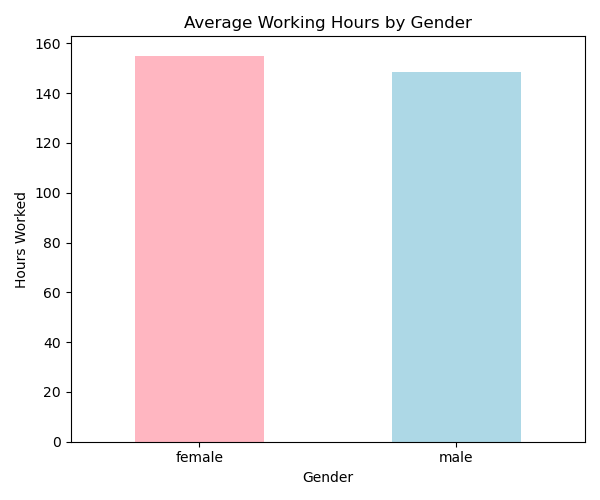
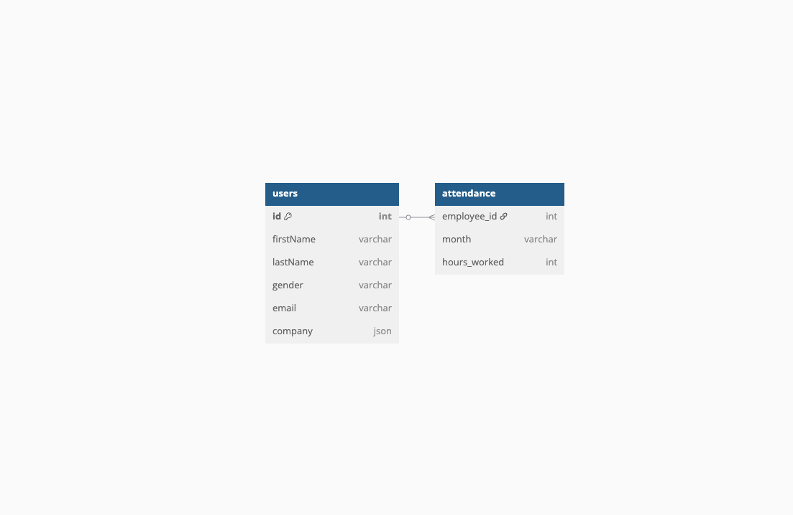

# HR Data Integration & Analytics Project

This project demonstrates the end-to-end process of collecting, integrating, and analyzing human resources (HR) data using Python and public APIs.

It simulates a real-world scenario where employee data is fetched from an external API, combined with internal attendance records, and used to generate actionable insights through data modeling and visualizations.

---

## 🔍 Objectives

- Fetch employee data from an external API
- Simulate internal data (attendance records)
- Integrate and clean data from multiple sources
- Analyze patterns in employee work hours
- Visualize insights using Python (matplotlib)
- Document relationships through an ERD

---

## 🛠️ Technologies Used

- Python (pandas, requests, matplotlib)
- Public API: [DummyJSON](https://dummyjson.com/users)
- CSV data simulation
- dbdiagram.io for ERD
- Jupyter Notebook / Scripts

---

## 📊 Sample Insights

### 1. Average Working Hours by Department  
*(bar chart image here)*

### 2. Average Working Hours by Gender  
*(bar chart image here)*

---

## 🧩 Data Model (ERD)

The project contains two main tables:  
- `users` (API-based employee information)  
- `attendance` (internally generated monthly work records)  

These are linked by `employee_id`, forming a one-to-many relationship.

*(Insert ERD image here or link)*

---

## 📁 File Structure

---

## 🚀 How to Run

1. Clone the repo  
2. Run the scripts in order:
   - `fetch_users.py`
   - `generate_attendance.py`
   - `merge_data.py`
   - `visualize.py`

3. View the generated CSVs and charts in the `/data` folder

---

## 🙋 About the Creator

This project was created as part of a data preparation practice for an internship focused on people data architecture.  
It highlights core skills in API usage, data cleaning, integration, visualization, and documentation.

### 1. Average Working Hours by Department  

### 2. Average Working Hours by Gender  

### 📘 ERD  

